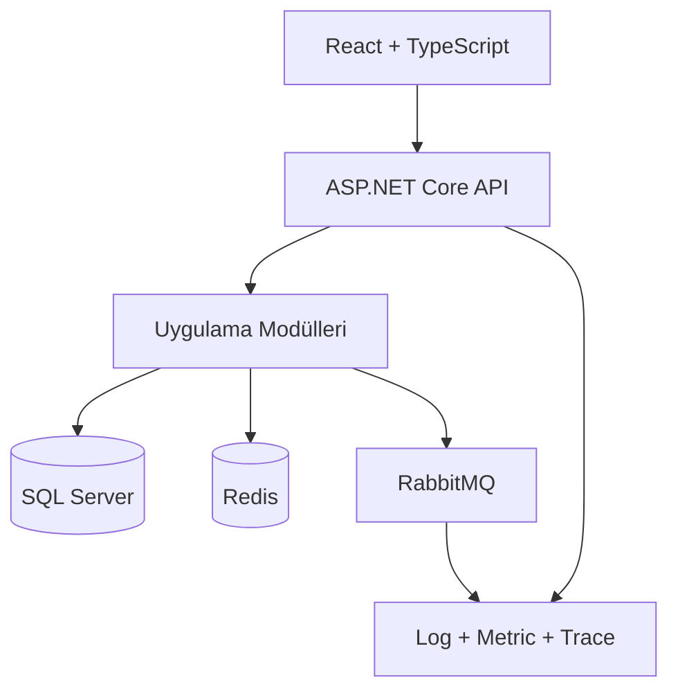
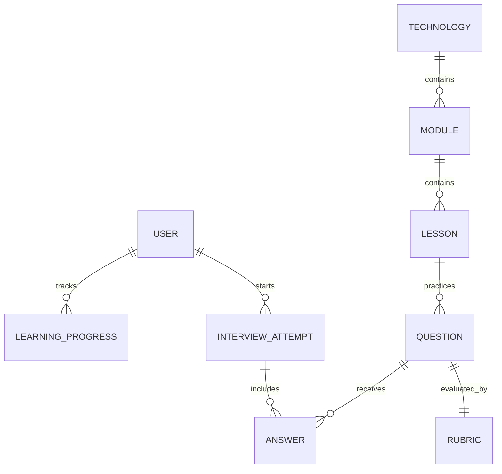
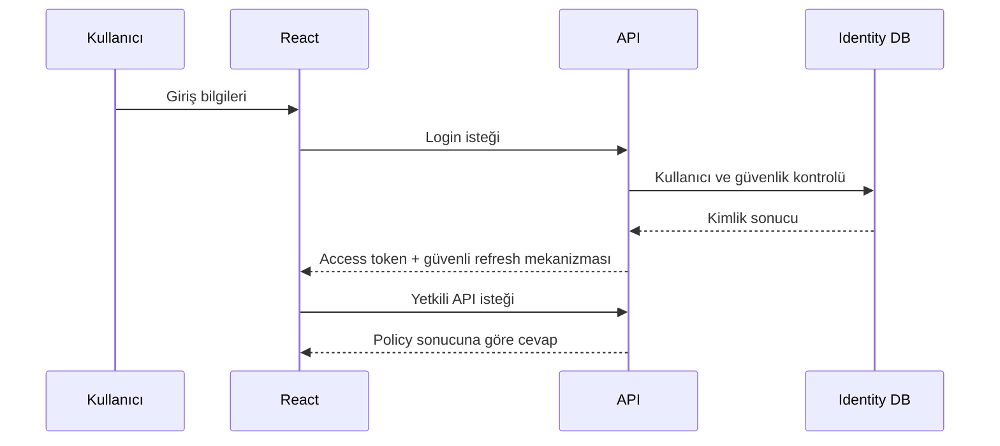
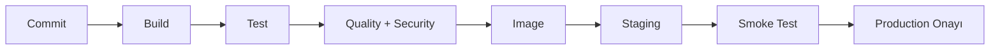

# Senior Full-Stack Akademi ve Mülakat Simülatörü

## Proje, İçerik ve Altyapı Planı

**Hedef profil:** .NET ağırlıklı full-stack geliştirici  
**Ana teknoloji odağı:** ASP.NET Core, C#, EF Core, LINQ, SQL Server, React, TypeScript  
**Destekleyici konular:** Authentication, authorization, middleware, API gateway, mikroservisler, RabbitMQ, Redis, loglama, izlenebilirlik, Docker, test, CI/CD, legacy modernizasyon ve design pattern'lar  
**Doküman amacı:** Öğrenme, uygulama, mülakat provası ve seviye ölçümünü tek ürün içinde birleştirecek yapıyı tanımlamak

---

## 1. Yönetici Özeti

Bu proje klasik soru-cevap ezberleten bir mülakat sitesi olmamalıdır. Kullanıcının:

1. Bir kavramı anlaşılır örneklerle öğrenmesini,
2. Kavramın gerçek projede nerede kullanıldığını görmesini,
3. Yanlış kullanımın oluşturacağı sorunları tanımasını,
4. Bir üretim vakasını çözmesini,
5. Kendi cevabını kıyaslayıp eksiklerini belirlemesini,
6. Gelişimini zaman içinde ölçmesini

sağlayan bir **teknik gelişim platformu** olmalıdır.

Mevcut HTML prototipi, soru filtreleme ve cevap inceleme deneyimi için doğru bir doğrulama çalışmasıdır. Ancak uzun vadeli hedef için içerik, değerlendirme, kullanıcı ilerlemesi ve uygulama altyapısı birbirinden ayrılmalıdır.

### Temel mimari kararı

İlk üretim sürümünde **modüler monolit** önerilir:

- React ve TypeScript tabanlı web istemcisi
- ASP.NET Core 8 Web API
- SQL Server ve EF Core
- Gereken sorgularda Dapper
- Redis ile kontrollü cache
- RabbitMQ ile yalnızca gerçekten asenkron olması gereken işler
- Serilog ve OpenTelemetry ile log, metric ve trace
- Docker Compose ile yerel geliştirme

Mikroservis, API gateway, Saga, Outbox ve benzeri yapılar öğrenme içeriğinde ayrıntılı biçimde bulunmalıdır. Fakat platformun kendisi, trafik ve ekip sınırları gerektirmeden mikroservislere ayrılmamalıdır. Bu ayrım, sitenin öğrettiği en önemli profesyonel kararlardan biri olacaktır: **Bir teknolojiyi bilmek, onu her projede kullanmak anlamına gelmez.**

---

## 2. Mevcut Prototip Analizi

Mevcut çalışma:

- Tek HTML dosyasında çalışmaktadır.
- 12 teknoloji başlığı içermektedir.
- 51 ana soru ve 36 saha sorusu olmak üzere toplam 87 soru barındırmaktadır.
- Konu, seviye ve soru tipi filtreleri sunmaktadır.
- Kullanıcının kendi cevabını yazmasına izin vermektedir.
- Model cevap, güçlü cevap sinyalleri, kırmızı bayraklar ve saha doğrulaması göstermektedir.
- İlerleme durumunu tarayıcıdaki `localStorage` içinde saklamaktadır.

### Güçlü yönler

- Kurulum gerektirmeden açılabilir.
- Mülakat deneyimini hızlı doğrular.
- Sorular doğrudan gerçek iş problemlerine odaklanır.
- Cevap yalnızca sonuç değil, düşünme yaklaşımı da sunar.
- Konu ve seviye filtreleri tekrar kullanım için uygundur.

### Geliştirilmesi gereken yönler

| Alan | Mevcut durum | Hedef durum |
| --- | --- | --- |
| İçerik yönetimi | Python içinde sabit veri | Yönetilebilir ve versiyonlanabilir içerik modeli |
| Öğrenme anlatımı | Soru kartına bağlı kısa açıklama | Ayrı ders, örnek, problem ve laboratuvar yapısı |
| İlerleme | `localStorage` | Kullanıcı hesabına bağlı kalıcı ilerleme |
| Değerlendirme | Kullanıcının manuel kıyaslaması | Rubric tabanlı puanlama ve konu analizi |
| Kod çalıştırma | Yok | Güvenli mini laboratuvar veya indirilebilir örnek proje |
| Design pattern | Dağınık örnekler | Problem odaklı ayrı pattern kataloğu |
| Arama | Basit metin arama | Etiket, ilişki ve öğrenme hedefi tabanlı arama |
| Raporlama | Kart durumu | Konu, beceri ve zaman bazlı gelişim raporu |
| İçerik güncelleme | HTML yeniden üretimi | Yönetim ekranı veya kaynak kontrollü içerik |
| Çoklu cihaz | Yok | Kullanıcı hesabıyla senkronizasyon |

### Korunması gereken özellikler

- Saha senaryosu yaklaşımı
- “Önce kendi cevabını yaz” akışı
- Model cevabı hemen göstermeme
- Güçlü sinyal ve kırmızı bayrak ayrımı
- Konu, seviye ve soru tipi filtreleri
- Tekrar çalışma listesi

---

## 3. Ürün Vizyonu

Platform dört ana deneyimi bir araya getirmelidir.

### 3.1 Öğrenme

Kullanıcı temel kavramdan üretim seviyesine kadar ilerler. Her ders:

- Kavramı tanımlar.
- Neden gerekli olduğunu açıklar.
- Gerçek kullanım örneği verir.
- Kod ve mimari örneği gösterir.
- Ne zaman kullanılmaması gerektiğini söyler.
- Sık hataları ve sonuçlarını anlatır.
- Sorun giderme adımları sunar.
- Küçük bir uygulama görevi verir.

### 3.2 Uygulama

Her ana konu bir örnek proje üzerinden pekiştirilir. Önerilen ana vaka:

> Vatandaş veya müşteri başvurularının oluşturulduğu, kurum verilerinin sorgulandığı, değerlendirme sürecinden geçtiği ve bildirim üretildiği kurumsal bir başvuru yönetim sistemi.

Bu vaka sayesinde:

- React form ve tablo ekranları,
- ASP.NET Core API,
- JWT ve policy authorization,
- EF Core ve SQL optimizasyonu,
- Dış servis entegrasyonu,
- RabbitMQ event akışı,
- Redis cache,
- Serilog, trace ve Grafana,
- Docker ve CI/CD

tek bir anlamlı alan üzerinde öğretilebilir.

### 3.3 Mülakat Simülasyonu

Sorular “X nedir?” ağırlıklı olmamalıdır. Aşağıdaki becerileri ölçmelidir:

- Belirsiz gereksinimi netleştirme
- Teknik karar verme
- Alternatifleri ve bedellerini açıklama
- Hata ayıklama
- Performans analizi
- Güvenlik riski görme
- Operasyonel etkiyi yönetme
- Kod inceleme
- Sistem tasarımı
- Geçmiş deneyimi ölçülebilir biçimde anlatma

### 3.4 Seviye Ölçümü

Kullanıcıya tek bir “70 puan” sonucu vermek yeterli değildir. Sonuç aşağıdaki boyutlarda gösterilmelidir:

- Kavram bilgisi
- Uygulama bilgisi
- Debug yaklaşımı
- Mimari karar kalitesi
- Güvenlik farkındalığı
- Performans farkındalığı
- Operasyon ve izlenebilirlik
- İletişim ve cevap yapılandırma

---

## 4. Kullanıcı Rolleri

| Rol | Sorumluluk |
| --- | --- |
| Öğrenci | Ders çalışma, alıştırma çözme, mülakat provası, ilerleme izleme |
| İçerik editörü | Ders, soru, rubric ve kaynak yönetimi |
| Teknik değerlendirici | Cevap kalitesini ve soru seviyesini gözden geçirme |
| Yönetici | Kullanıcı, rol, yayın, özellik ve sistem ayarları |

İlk sürümde öğrenci ve yönetici rolleri yeterlidir. Editör ve değerlendirici rolleri içerik ekibi büyüdüğünde ayrılabilir.

---

## 5. Bilgi Mimarisi ve Sayfalar

### Ana navigasyon

1. **Ana Panel**
2. **Öğrenme Rehberi**
3. **Design Pattern Rehberi**
4. **Mülakat Simülatörü**
5. **Uygulama Laboratuvarları**
6. **Seviye Analizi**
7. **Tekrar Listem**
8. **Profil ve Hedefler**

### Önerilen route yapısı

```text
/
/dashboard
/learn
/learn/:technologySlug
/learn/:technologySlug/:lessonSlug
/patterns
/patterns/:patternSlug
/interview
/interview/session/:sessionId
/labs
/labs/:labSlug
/assessment
/assessment/results/:attemptId
/review
/profile
/admin/content
```

### Ana panel

Ana panelde şu bilgiler görünmelidir:

- Devam edilen ders
- Günün tekrar soruları
- Son mülakat puanı
- Zayıf konu başlıkları
- Tamamlanan laboratuvarlar
- Haftalık öğrenme süresi
- Önerilen bir sonraki çalışma

---

## 6. Öğrenme İçerik Haritası

### 6.1 C# ve .NET

- Değer ve referans tipleri
- Nullable reference types
- Generic yapılar
- Delegate, event ve lambda
- LINQ çalışma modeli
- Exception yönetimi
- `IDisposable` ve kaynak yönetimi
- `async`/`await`
- Thread pool ve blocking
- CancellationToken
- Dependency injection ve lifetime
- Configuration ve Options pattern
- Reflection ve expression tree
- GC, allocation ve performans
- Hosted service ve background worker
- Resilience ve dış kaynak yönetimi

### 6.2 ASP.NET Core

- HTTP ve REST temelleri
- Controller ve Minimal API karşılaştırması
- Model binding
- Validation
- Middleware pipeline
- Filters
- Dependency injection
- ProblemDetails
- API versioning
- Pagination, filtering ve sorting
- Idempotency
- Rate limiting
- CORS
- Health check
- Background services
- File upload güvenliği
- API contract ve backward compatibility
- Performans ve response compression

### 6.3 Authentication ve Authorization

- Authentication ile authorization farkı
- Cookie ve token tabanlı kimlik doğrulama
- JWT yapısı
- Access token ve refresh token
- Token rotation
- Claim, role ve policy
- Resource-based authorization
- ASP.NET Core Identity
- OAuth 2.0 ve OpenID Connect zihinsel modeli
- Çoklu istemci ve BFF yaklaşımı
- Secret yönetimi
- CSRF, XSS ve token hırsızlığı
- Hesap kilitleme ve brute-force koruması
- Audit log
- Yetki değişikliğinin aktif oturumlara etkisi

### 6.4 EF Core ve LINQ

- `DbContext` yaşam döngüsü
- Change tracking
- `AsNoTracking`
- İlişki modelleme
- Migration
- Eager, explicit ve lazy loading
- Projection
- `Include` maliyeti
- N+1 problemi
- Split query ve single query
- Transaction
- Concurrency token
- Execution strategy
- Global query filter
- Interceptor
- Compiled query
- Bulk işlem seçenekleri
- Generated SQL inceleme
- EF Core ile Dapper seçim ölçütleri

### 6.5 SQL Server ve Optimizasyon

- İlişkisel modelleme
- Normalizasyon ve kontrollü denormalizasyon
- Primary key, foreign key ve unique constraint
- Clustered ve nonclustered index
- Composite index ve kolon sırası
- Covering index
- SARGability
- Execution plan okuma
- Cardinality ve istatistik
- Parameter sniffing
- Transaction ve isolation level
- Lock, blocking ve deadlock
- Window function
- CTE, temp table ve table variable
- Stored procedure
- Pagination
- Query Store
- `STATISTICS IO/TIME`
- Veri doğruluğu ve reconciliation

### 6.6 React ve TypeScript

- Component zihinsel modeli
- Props ve state
- Controlled ve uncontrolled input
- Hook kuralları
- `useEffect` ve cleanup
- State sahipliği
- Formik ve Yup
- Asenkron istek ve race condition
- AbortController
- Server state ve client state
- Context ve reducer
- Memoization
- React Profiler
- Büyük liste ve virtualization
- Error boundary
- Erişilebilirlik
- TypeScript type narrowing
- Generic component
- API DTO ve UI model ayrımı
- Test edilebilir component tasarımı

### 6.7 Dağıtık Sistemler ve Mikroservisler

- Modüler monolit ve mikroservis karşılaştırması
- Servis sınırı belirleme
- Bounded context
- Database per service
- Senkron ve asenkron iletişim
- Eventual consistency
- API gateway
- Service discovery
- Configuration yönetimi
- Distributed transaction problemi
- Idempotency
- Retry, timeout ve circuit breaker
- Saga
- Outbox ve inbox
- Contract versioning
- Distributed tracing
- Deployment ve geri alma
- Mikroservis anti-pattern'ları

### 6.8 Mesajlaşma ve RabbitMQ

- Queue, exchange ve binding
- Routing key
- Ack ve nack
- Prefetch
- Retry
- Dead-letter queue
- Duplicate delivery
- Consumer idempotency
- Ordering
- Poison message
- Publisher confirm
- Outbox
- Queue depth ve throughput
- Şema ve event versioning

### 6.9 Redis ve Cache

- Cache'in doğru kullanım alanı
- Cache-aside
- TTL
- Invalidation
- Cache key standardı
- Cache stampede
- Stale data
- Distributed lock
- Session ve rate limit
- Redis erişilemezken fallback
- Hit ratio ve gerçek kullanıcı etkisi

### 6.10 Loglama ve İzlenebilirlik

- Structured logging
- Log level
- Correlation ID
- Trace ID ve span
- Metric, log ve trace farkı
- OpenTelemetry
- Serilog
- P95/P99 latency
- Error rate
- SLI, SLO ve alarm
- Dashboard tasarımı
- Hassas veri maskeleme
- Business outcome metriği
- Runbook
- Incident yönetimi ve postmortem

### 6.11 Docker ve Teslimat

- Image ve container
- Dockerfile
- Multi-stage build
- Layer cache
- `.dockerignore`
- Environment ve secret
- Health check
- Liveness ve readiness
- Non-root user
- Docker Compose
- CI pipeline
- Migration çalıştırma stratejisi
- Blue/green ve canary kavramları
- Rollback

### 6.12 Test

- Unit test
- Integration test
- Contract test
- End-to-end test
- Test pyramid ve test kapsamı
- Mock, fake ve stub
- Testcontainers
- WebApplicationFactory
- React Testing Library
- Database isolation
- Deterministic test
- Performance test
- Security test
- Characterization test

### 6.13 Legacy Modernizasyon

- Legacy kodu anlama
- Characterization test
- Strangler pattern
- Anti-corruption layer
- Incremental migration
- Feature flag
- Parallel run
- Veri mutabakatı
- Contract uyumluluğu
- Rollback
- Eski ve yeni sistem performansını ölçme

---

## 7. Design Pattern Bölümü

Design pattern içeriği, pattern isimlerini ezberletmek yerine şu soruya cevap vermelidir:

> Hangi problemde, hangi koşullar altında, hangi bedelleri kabul ederek bu deseni kullanırım?

### 7.1 Pattern konu grupları

| Grup | Pattern'lar |
| --- | --- |
| Creational | Factory Method, Abstract Factory, Builder |
| Structural | Adapter, Facade, Decorator, Proxy |
| Behavioral | Strategy, Observer, State, Command, Template Method, Mediator |
| Data access | Repository, Unit of Work, Specification, Query Object |
| Application | CQRS, Pipeline Behavior, Result, Validation |
| Integration | Anti-Corruption Layer, Gateway, BFF |
| Distributed system | Outbox, Inbox, Saga, Circuit Breaker, Retry, Bulkhead |
| Cache | Cache-Aside, Read-Through, Write-Through, Stale-While-Revalidate |
| Frontend | Custom Hook, Provider, Reducer, Compound Component, Container/Presentational |
| Modernization | Strangler Fig, Branch by Abstraction, Feature Toggle |

### 7.2 Her pattern için standart anlatım

Her pattern sayfasında aşağıdaki başlıklar bulunmalıdır:

1. Çözdüğü problem
2. Kullanılma sinyalleri
3. Kullanılmaması gereken durumlar
4. Basit zihinsel model
5. .NET veya React kod örneği
6. Gerçek proje örneği
7. Alternatifler
8. Sağladığı fayda
9. Getirdiği karmaşıklık
10. Sık yanlış kullanım
11. Test stratejisi
12. Saha sorusu
13. Kod inceleme sorusu
14. Mini alıştırma

### 7.3 Problemden pattern'a seçim tablosu

| Problem | Öncelikli seçenek | Kontrol edilmesi gereken nokta |
| --- | --- | --- |
| MERSİS, Maliye ve ESBİS farklı davranıyor | Strategy + Adapter | Ortak sözleşme gerçekten kararlı mı? |
| Nesne oluşturma karmaşık ve sağlayıcıya göre değişiyor | Factory | Basit constructor yeterli olabilir mi? |
| Handler öncesi validation, log ve transaction gerekiyor | Pipeline Behavior | Sıra ve hata davranışı açık mı? |
| Dinamik filtreler farklı sorgularda tekrar ediyor | Specification veya Query Object | EF sorgusunu gereksiz soyutluyor mu? |
| DB commit ile event publish birlikte güvenilir olmalı | Outbox | Duplicate publish için idempotency var mı? |
| Birden fazla serviste uzun iş akışı var | Saga | Compensation gerçekten mümkün mü? |
| Dış servis geçici olarak başarısız | Timeout + Retry + Circuit Breaker | Retry yalnızca güvenli işlemlerde mi? |
| Eski servis sözleşmesi yeni domain'i bozuyor | Anti-Corruption Layer | Mapping sınırı doğru yerde mi? |
| Frontend iş mantığı birçok ekranda tekrar ediyor | Custom Hook | Hook gereksiz genel hale getiriliyor mu? |
| Büyük formda durum geçişleri karmaşık | Reducer veya State pattern | Basit state yeterli mi? |
| Legacy modül kademeli taşınacak | Strangler Fig | Trafik yönlendirme ve geri dönüş planı var mı? |

### 7.4 Özellikle öğretilmesi gereken anti-pattern'lar

- God service
- Anemic domain model
- Generic repository'nin sorgu yeteneklerini sakatlaması
- Her işlem için gereksiz MediatR katmanı
- Her tabloyu ayrı mikroservis yapmak
- Shared database ile sözde mikroservis
- Sonsuz retry
- Catch edip hatayı yutmak
- Loglara hassas veri yazmak
- Cache'i source of truth gibi kullanmak
- Her şeyi global state'e koymak
- `useEffect` ile türetilebilir state üretmek
- Controller veya handler içinde tüm iş kurallarını toplamak

---

## 8. Ders İçerik Şablonu

Her ders aşağıdaki yapıyı kullanmalıdır:

```yaml
title: "ASP.NET Core Middleware Sırası"
slug: "middleware-sirasi"
technology: "aspnet-core"
level: "intermediate"
estimated_minutes: 35
prerequisites:
  - "http-request-response"
learning_objectives:
  - "Request pipeline akışını açıklayabilme"
  - "Authentication ve authorization sırasını kurabilme"
sections:
  - concept
  - mental_model
  - code_example
  - real_world_usage
  - common_failures
  - debugging
  - decision_guide
  - summary
practice:
  - mini_quiz
  - scenario
  - code_review
  - lab
```

### Anlatım ilkeleri

- Önce problem, sonra teknik terim anlatılmalıdır.
- Kod örneği tek başına bırakılmamalı, davranışı açıklanmalıdır.
- “Ne zaman kullanılır?” kadar “ne zaman kullanılmaz?” da belirtilmelidir.
- Happy path ile yetinilmemelidir.
- Güvenlik, performans ve operasyon etkisi ayrı ayrı ele alınmalıdır.
- Her ileri konu için önce gerekli temel konu bağlantısı verilmelidir.
- Örnekler aynı kurumsal proje hikayesinde ilerlemelidir.

---

## 9. Soru ve Değerlendirme Modeli

### 9.1 Soru tipleri

| Tip | Ölçtüğü beceri |
| --- | --- |
| Kavram açıklama | Temel zihinsel model |
| Karşılaştırma | Seçim ölçütü ve trade-off |
| Saha vakası | Üretim problemi çözme |
| Debug | Sistematik hata ayıklama |
| Kod inceleme | Risk ve kalite farkındalığı |
| Sistem tasarımı | Sınır, akış ve ölçek kararı |
| SQL analizi | Sorgu ve execution plan düşüncesi |
| Güvenlik vakası | Tehdit ve koruma yaklaşımı |
| Incident | Etki sınırlama, kök neden ve önleme |
| Deneyim anlatımı | STAR yapısı ve ölçülebilir sonuç |

### 9.2 Soru veri modeli

Her soru en az şu alanları taşımalıdır:

```yaml
id: "q-aspnet-incident-001"
topic: "aspnet-core"
skills:
  - "middleware"
  - "observability"
level: "advanced"
type: "incident"
prompt: "API bazen 500 dönüyor ancak loglarda exception görünmüyor..."
clarifying_questions:
  - "Hata tüm instance'larda mı?"
  - "Son deployment ne zaman yapıldı?"
expected_signals:
  - "correlation-id"
  - "global-exception-handler"
  - "downstream-timing"
red_flags:
  - "her yere try-catch eklemek"
rubric:
  diagnosis: 25
  mitigation: 20
  root_cause: 20
  prevention: 20
  communication: 15
model_answer: "..."
follow_up_questions:
  - "Response başladıktan sonra hata oluşursa ne değişir?"
references:
  - "lesson:middleware-sirasi"
```

### 9.3 Puanlama

İlk sürümde güvenilir ve açıklanabilir bir rubric kullanılmalıdır:

- Beklenen sinyaller
- Kritik eksikler
- Riskli veya yanlış öneriler
- Cevabın yapılandırılması
- Alternatif ve trade-off açıklaması
- Ölçüm ve doğrulama yaklaşımı

Yapay zeka destekli değerlendirme daha sonra eklenebilir. Ancak sistem:

- Model sonucunu kesin doğru kabul etmemeli,
- Rubric'i kullanıcıya göstermeli,
- Puanın nedenini açıklamalı,
- Kullanıcının cevabını saklamadan önce açık rıza ve veri politikası sunmalı,
- Hassas proje bilgisinin girilmemesi konusunda uyarmalıdır.

### 9.4 Cevap geri bildirimi

Her sonuç ekranı şu yapıda olmalıdır:

1. Güçlü noktalar
2. Eksik kalan kavramlar
3. Riskli ifadeler
4. Daha profesyonel cevap sırası
5. Örnek cevap
6. Takip soruları
7. İlgili dersler
8. Tekrar tarihi

---

## 10. Önerilen Teknik Mimari



### Teknoloji seçimi

| Katman | Öneri | Gerekçe |
| --- | --- | --- |
| Web | React 18+, TypeScript, Vite | Hızlı geliştirme, güçlü tip desteği |
| UI | MUI | Mevcut deneyimle uyum, erişilebilir bileşenler |
| Form | React Hook Form veya Formik + Yup | Mevcut deneyim korunabilir; yeni modüllerde performans ölçülerek seçim yapılır |
| Veri erişimi | TanStack Query | Cache, loading, retry ve invalidation yönetimi |
| Backend | ASP.NET Core 8 Web API | CV ve hedef uzmanlıkla doğrudan uyum |
| Uygulama akışı | MediatR, seçici CQRS | Use-case ayrımı ve pipeline davranışları |
| ORM | EF Core 8 | Transactional işlerde üretkenlik |
| Hızlı okuma | Dapper | Ölçümle kanıtlanan ağır rapor sorguları |
| Veritabanı | SQL Server | Mevcut uzmanlıkla uyum |
| Cache | Redis | İlerleme özeti, referans içerik ve rate limiting |
| Mesajlaşma | RabbitMQ | Asenkron rapor, bildirim ve değerlendirme işleri |
| Log | Serilog | Structured logging |
| Telemetry | OpenTelemetry | Vendor bağımsız trace ve metric |
| Dashboard | Grafana | Sistem ve iş metriği görünürlüğü |
| Yerel ortam | Docker Compose | Tek komutla bağımlılıkları çalıştırma |
| CI/CD | GitHub Actions | Build, test, tarama ve image üretimi |

### Neden modüler monolit?

- Başlangıçta tek ekip ve tek ürün vardır.
- Transaction sınırları daha kolay yönetilir.
- Debug ve yerel geliştirme daha basittir.
- Deployment maliyeti düşüktür.
- Modül sınırları korunursa daha sonra servis ayrıştırması mümkündür.
- Mikroservis konuları, ürünün eğitim laboratuvarlarında yine uygulamalı olarak öğretilebilir.

---

## 11. Backend Modülleri

```text
src/
  Web/
  Modules/
    Identity/
    Learning/
    Interview/
    Assessment/
    Progress/
    Labs/
    ContentManagement/
  BuildingBlocks/
    Application/
    Domain/
    Infrastructure/
    Observability/
tests/
  UnitTests/
  IntegrationTests/
  ArchitectureTests/
  EndToEndTests/
```

### Modül sorumlulukları

| Modül | Sorumluluk |
| --- | --- |
| Identity | Kayıt, oturum, token, rol, policy, profil |
| Learning | Teknoloji, konu, ders, ön koşul ve öğrenme yolu |
| Interview | Soru havuzu, oturum oluşturma ve takip soruları |
| Assessment | Rubric, cevap değerlendirme ve seviye hesaplama |
| Progress | Tamamlama, tekrar planı, güçlü ve zayıf alanlar |
| Labs | Uygulama görevleri, teslimler ve kontrol listeleri |
| ContentManagement | Taslak, inceleme, yayın ve versiyon yönetimi |

### Katman sınırları

- Domain katmanı framework bağımlılığı taşımamalıdır.
- Application katmanı use-case akışını yönetmelidir.
- Infrastructure katmanı EF Core, Redis, RabbitMQ ve dış servisleri içermelidir.
- Web katmanı HTTP sözleşmesine odaklanmalıdır.
- Modüller doğrudan birbirinin tablolarına erişmemelidir.
- Modüller arası erişim public application contract üzerinden yapılmalıdır.

---

## 12. Frontend Yapısı

```text
src/
  app/
    router/
    providers/
    theme/
  features/
    auth/
    learning/
    interview/
    assessment/
    progress/
    labs/
  shared/
    api/
    components/
    hooks/
    types/
    utils/
  pages/
```

### Frontend ilkeleri

- Server state, TanStack Query gibi bir araçla yönetilmelidir.
- Form state global store'a taşınmamalıdır.
- API DTO'ları ile ekran modelleri ayrılmalıdır.
- Her async ekranda loading, empty, error ve retry durumları bulunmalıdır.
- Uzun listeler server-side pagination kullanmalıdır.
- İstek yarışları iptal veya request identity ile kontrol edilmelidir.
- Yetki kontrolü yalnızca UI gizlemeye dayanmamalı, API tarafından uygulanmalıdır.
- Erişilebilir klavye navigasyonu ve anlamlı form hataları sağlanmalıdır.

---

## 13. Veri Modeli

### Ana varlıklar



### Önerilen tablolar

- `Users`
- `Roles`
- `UserRoles`
- `RefreshTokens`
- `Technologies`
- `Modules`
- `Lessons`
- `LessonSections`
- `LessonPrerequisites`
- `Patterns`
- `PatternRelations`
- `Questions`
- `QuestionSkills`
- `Rubrics`
- `RubricCriteria`
- `InterviewTemplates`
- `InterviewSessions`
- `Answers`
- `AnswerScores`
- `LearningProgress`
- `ReviewItems`
- `Labs`
- `LabSubmissions`
- `ContentVersions`
- `AuditLogs`
- `OutboxMessages`

### İçerik saklama kararı

İçerik iki şekilde yönetilebilir:

1. **Başlangıç:** Markdown veya JSON dosyaları Git üzerinden versiyonlanır ve seed edilir.
2. **Üretim:** İçerik veritabanında taslak, inceleme, yayın ve versiyon durumlarıyla saklanır.

Öneri: İlk sürümde Git tabanlı içerik kullanıp yönetim ekranını ikinci aşamada eklemek. Böylece önce içerik kalitesi ve kullanıcı deneyimi doğrulanır.

---

## 14. API Taslağı

### Learning

```http
GET    /api/technologies
GET    /api/technologies/{slug}/modules
GET    /api/lessons/{slug}
POST   /api/lessons/{id}/complete
GET    /api/learning-path
```

### Interview

```http
POST   /api/interview-sessions
GET    /api/interview-sessions/{id}
POST   /api/interview-sessions/{id}/answers
POST   /api/interview-sessions/{id}/complete
GET    /api/interview-sessions/{id}/result
```

### Progress

```http
GET    /api/progress/summary
GET    /api/progress/topics
GET    /api/review-items
POST   /api/review-items/{id}/review
```

### Admin

```http
POST   /api/admin/lessons
PUT    /api/admin/lessons/{id}
POST   /api/admin/lessons/{id}/publish
POST   /api/admin/questions
PUT    /api/admin/questions/{id}
```

### API standartları

- Tüm hatalar `ProblemDetails` biçiminde dönmelidir.
- Liste uçları pagination kullanmalıdır.
- Mutation isteklerinde idempotency ihtiyacı değerlendirilmelidir.
- API versioning yalnızca gerçek sözleşme ihtiyacında eklenmelidir.
- Validation hataları alan bazlı olmalıdır.
- Correlation ID response header içinde dönmelidir.
- Swagger/OpenAPI sözleşmesi CI içinde doğrulanmalıdır.

---

## 15. Authentication, Authorization ve Güvenlik

### Önerilen akış



### Kararlar

- Parolalar ASP.NET Core Identity ile hash edilmelidir.
- Access token kısa ömürlü olmalıdır.
- Refresh token rotation uygulanmalıdır.
- Refresh token mümkünse `HttpOnly`, `Secure`, `SameSite` cookie içinde tutulmalıdır.
- Rol kontrolü yerine kritik işlemlerde policy kullanılmalıdır.
- Kaynak sahipliği için resource-based authorization uygulanmalıdır.
- Admin işlemleri audit log üretmelidir.
- Rate limiting login ve değerlendirme uçlarında farklı policy kullanmalıdır.
- CORS yalnızca bilinen origin'lere izin vermelidir.
- Secret değerler repository içinde bulunmamalıdır.

### Middleware sırası

```text
ForwardedHeaders
CorrelationId
ExceptionHandler
HTTPS Redirection
Security Headers
Routing
CORS
Rate Limiting
Authentication
Authorization
Request Logging
Endpoints
```

Kesin sıra uygulamanın hosting ve proxy koşullarına göre test edilmelidir. Özellikle CORS, rate limit, authentication ve exception davranışı integration test ile doğrulanmalıdır.

---

## 16. Cache ve Mesajlaşma

### Redis kullanım alanları

- Sık okunan yayınlanmış ders özeti
- Dashboard ilerleme özeti
- Rate limit state
- Kısa süreli değerlendirme job durumu

Redis aşağıdaki verilerin tek kaynağı olmamalıdır:

- Kullanıcı cevabı
- Ders tamamlama kaydı
- Puan geçmişi
- Yetki bilgisi

### RabbitMQ kullanım alanları

- Uzun süren cevap değerlendirme işi
- Rapor oluşturma
- E-posta veya bildirim
- İçerik indeksleme

### Outbox

Bir transaction sonucu event üretilecekse:

1. Domain değişikliği yapılır.
2. Event, aynı SQL transaction içinde `OutboxMessages` tablosuna yazılır.
3. Background worker mesajı RabbitMQ'ya gönderir.
4. Publisher confirm alınır.
5. Outbox kaydı işlendi olarak işaretlenir.
6. Consumer duplicate mesajı güvenli karşılar.

---

## 17. Gözlemlenebilirlik

### Log

Her request için:

- Correlation ID
- Trace ID
- Route
- Status code
- Duration
- User ID veya anonim kimlik
- Modül ve use-case adı
- Downstream süreleri

loglanmalıdır. Token, parola, kişisel veri ve tam kullanıcı cevabı varsayılan olarak loglanmamalıdır.

### Metric

#### Teknik metrikler

- Request rate
- Error rate
- P50, P95, P99 latency
- SQL command duration
- Cache hit ratio
- Queue depth
- Consumer throughput
- Retry ve DLQ sayısı
- Background job duration

#### Ürün metrikleri

- Ders tamamlama oranı
- Mülakat oturumu tamamlama oranı
- Konu bazlı ortalama puan
- Tekrar sonrası puan değişimi
- Laboratuvar tamamlama oranı
- Kullanıcının takıldığı ders adımı

### Trace

Bir mülakat değerlendirme akışı şu span'leri içerebilir:

```text
HTTP POST /interview-sessions/{id}/answers
  -> ValidateAnswer
  -> SaveAnswer
  -> CreateAssessmentJob
  -> WriteOutbox
  -> PublishMessage
  -> AssessmentWorker
  -> SaveScore
```

### Alarm

Alarm yalnızca aksiyon alınabilir olduğunda üretilmelidir:

- 5 dakika boyunca yüksek hata oranı
- P95 latency SLO ihlali
- Queue depth sürekli büyümesi
- DLQ artışı
- Login başarısızlıklarında anormal yükseliş
- Değerlendirme job'larının belirlenen sürede tamamlanmaması

Her alarmın owner ve runbook bağlantısı olmalıdır.

---

## 18. Test Stratejisi

| Test seviyesi | Kapsam |
| --- | --- |
| Unit | Domain kuralları, rubric hesaplama, seviye algoritması |
| Integration | API, EF Core, SQL Server, Redis, RabbitMQ |
| Architecture | Modül sınırları ve yasak bağımlılıklar |
| Contract | Frontend-backend ve event şeması |
| Component | React form, soru kartı, sonuç görünümü |
| End-to-end | Kayıt, ders, mülakat, sonuç ve tekrar akışı |
| Performance | Soru arama, dashboard ve rapor sorguları |
| Security | Yetki atlama, token, rate limit, veri sızıntısı |

### Kritik test senaryoları

- Aynı cevap iki kez gönderildiğinde duplicate oluşmaması
- Yetkisiz kullanıcının admin içeriğine erişememesi
- Refresh token tekrar kullanıldığında oturum zincirinin iptal edilmesi
- Değerlendirme worker'ı çöktüğünde mesajın kaybolmaması
- Redis kapalıyken ana öğrenme akışının kontrollü çalışması
- RabbitMQ kapalıyken outbox kaydının korunması
- SQL deadlock veya transient hata durumunda sınırlı retry
- Eski içerik sürümüne ait cevabın doğru rubric ile değerlendirilebilmesi
- Frontend stale response'un yeni ekran state'ini bozmaması

---

## 19. CI/CD ve Ortamlar

### Pipeline



### CI adımları

1. Backend restore ve build
2. Frontend install ve build
3. Unit test
4. Integration test
5. Lint ve format kontrolü
6. Dependency vulnerability kontrolü
7. Secret taraması
8. Docker image üretimi
9. Image vulnerability taraması
10. Staging deployment
11. Migration doğrulama
12. Smoke test
13. Onaylı production deployment

### Ortamlar

| Ortam | Amaç |
| --- | --- |
| Local | Docker Compose ile geliştirici ortamı |
| Test | Otomatik integration ve contract test |
| Staging | Production benzeri kabul ve smoke test |
| Production | Gerçek kullanıcı ortamı |

### Migration stratejisi

- Migration uygulama başlangıcında kontrolsüz çalıştırılmamalıdır.
- CI/CD içinde ayrı ve gözlemlenebilir bir adım olmalıdır.
- Geriye uyumlu, iki aşamalı şema değişiklikleri tercih edilmelidir.
- Büyük veri değişiklikleri ayrı job olarak çalıştırılmalıdır.
- Deployment geri alınsa bile eski uygulamanın yeni şemayla çalışması planlanmalıdır.

---

## 20. Mikroservise Geçiş Kriterleri

Mikroservise geçiş, yalnızca aşağıdaki sinyallerden biri veya birkaçı oluştuğunda değerlendirilmelidir:

- Modüllerin farklı ölçek ihtiyacı vardır.
- Bağımsız deployment gerçek iş değeri üretmektedir.
- Ayrı ekip sahipliği oluşmuştur.
- Bir modülün hata alanı diğerlerini kabul edilemez biçimde etkilemektedir.
- Teknoloji veya veri yaşam döngüsü ciddi biçimde ayrışmıştır.
- Modül sınırları uygulamada ve veride yeterince olgunlaşmıştır.

### İlk ayrıştırma adayları

1. Asenkron değerlendirme worker'ı
2. Bildirim servisi
3. Arama ve içerik indeksleme
4. Raporlama

### Gateway

Tek backend varken gateway eklemek zorunlu değildir. Servisler ayrıştığında gateway:

- Route yönetimi
- Authentication doğrulama
- Rate limiting
- Request correlation
- Header dönüşümü
- Merkezi telemetry

için kullanılabilir.

Business rule gateway içine taşınmamalıdır. Gateway'in erişilemezliği tüm sistemi etkileyebileceği için health check, timeout, telemetry ve ölçekleme ayrıca tasarlanmalıdır.

---

## 21. Uygulama Laboratuvarları

### Lab 1: Güvenli başvuru API'si

- ASP.NET Core API
- Validation
- ProblemDetails
- JWT
- Policy authorization
- Idempotent POST
- Integration test

### Lab 2: EF Core ve SQL performansı

- N+1 problemi
- Projection
- `AsNoTracking`
- Execution plan
- Index
- Query Store karşılaştırması

### Lab 3: React arama ve form ekranı

- Formik veya React Hook Form
- Yup veya Zod
- Debounce
- AbortController
- Pagination
- Loading, empty ve error state
- Component test

### Lab 4: Güvenilir event işleme

- RabbitMQ
- Outbox
- Consumer idempotency
- Retry
- DLQ
- Trace

### Lab 5: Production incident

- Yüksek API latency
- SQL blocking
- Cache davranışı
- Log, metric ve trace
- Etki sınırlama
- Root cause
- Kalıcı aksiyon

### Lab 6: Legacy modernizasyon

- Characterization test
- Strangler routing
- Anti-corruption layer
- Feature flag
- Parallel result comparison
- Rollback planı

---

## 22. Kişiselleştirilmiş Öğrenme Yolu

Mevcut deneyim ve hedefler dikkate alındığında önerilen sıra:

### Aşama 1: Derinleştirme

1. ASP.NET Core pipeline ve API contract
2. EF Core davranışı ve LINQ-SQL çevirisi
3. SQL execution plan ve index stratejisi
4. Async, cancellation ve transaction sınırları
5. React form, request ve render davranışı

### Aşama 2: Üretim Güvenilirliği

1. Authentication ve policy authorization
2. Structured logging ve distributed tracing
3. Retry, timeout ve circuit breaker
4. Redis cache tutarlılığı
5. RabbitMQ, idempotency ve Outbox

### Aşama 3: Mimari Karar

1. Modüler monolit
2. CQRS ve MediatR sınırları
3. Repository, Specification ve Query Object
4. API gateway ve BFF
5. Mikroservis ayrıştırma kriterleri
6. Saga ve eventual consistency

### Aşama 4: Senior Mülakat

1. Incident çözümü
2. System design
3. Kod ve SQL inceleme
4. Trade-off anlatımı
5. Proje hikayesini ölçülebilir sonuçlarla sunma

---

## 23. Yol Haritası

### Faz 0: İçerik ve UX doğrulama

**Süre:** 1-2 hafta

- Mevcut HTML prototipini koru
- Design pattern başlığını ekle
- İkinci öğrenme sayfasının içerik şablonunu doğrula
- 3 örnek ders hazırla
- 20 soruyu rubric ile yeniden modelle
- Kullanıcı akışını gerçek çalışma oturumlarıyla test et

**Çıkış kriteri:** Kullanıcı bir konuyu öğrenebilmeli, soru çözebilmeli ve eksiklerini anlayabilmelidir.

### Faz 1: MVP

**Süre:** 4-6 hafta

- React uygulaması
- ASP.NET Core API
- Kullanıcı hesabı
- Öğrenme rehberi
- Mülakat oturumu
- Rubric tabanlı değerlendirme
- İlerleme kaydı
- Tekrar listesi
- Admin olmadan Git tabanlı içerik
- Docker Compose
- Temel log, metric ve trace

**Çıkış kriteri:** Kullanıcı farklı cihazlarda kaldığı yerden devam edebilmeli ve konu bazlı gelişimini görebilmelidir.

### Faz 2: İçerik ve değerlendirme sistemi

**Süre:** 4-6 hafta

- İçerik yönetimi
- Taslak, inceleme ve yayın
- İçerik versiyonlama
- Soru bankası
- Mülakat şablonları
- Laboratuvarlar
- Gelişmiş seviye analizi
- Spaced repetition

**Çıkış kriteri:** Yeni içerik kod değişikliği olmadan güvenli biçimde yayınlanabilmelidir.

### Faz 3: Üretim dayanıklılığı

**Süre:** 3-5 hafta

- Redis
- RabbitMQ
- Outbox
- Background assessment worker
- OpenTelemetry
- Grafana dashboard
- SLO ve alarm
- Security hardening
- Performance test

**Çıkış kriteri:** Asenkron işler kaybolmamalı, kritik kullanıcı akışları gözlemlenebilir olmalıdır.

### Faz 4: Gelişmiş deneyim

- Yapay zeka destekli açıklanabilir geri bildirim
- Sesli mülakat provası
- Kod ve SQL çalışma alanı
- Takım veya mentor paneli
- Kişiselleştirilmiş öğrenme önerisi
- İçerik ilişki grafiği

---

## 24. Önceliklendirilmiş Backlog

### P0

- İçerik şemasını belirleme
- Öğrenme sayfası
- Pattern sayfası
- Soru çözme akışı
- Rubric
- İlerleme
- Authentication
- Responsive ve erişilebilir UI
- Unit ve integration test

### P1

- Tekrar sistemi
- Laboratuvarlar
- Admin içerik yönetimi
- İçerik versiyonlama
- Dashboard
- OpenTelemetry
- Docker Compose

### P2

- RabbitMQ ve Outbox
- Redis
- Gelişmiş rapor
- Yapay zeka geri bildirimi
- Mentor görünümü
- Mikroservis ayrıştırması

---

## 25. Riskler ve Önlemler

| Risk | Etki | Önlem |
| --- | --- | --- |
| İçeriğin çok genişleyip yüzeysel kalması | Öğrenme değeri düşer | Her konuda hedef, ön koşul ve kabul kriteri |
| Pattern ezberine dönüşme | Profesyonellik ölçülemez | Problem ve trade-off odaklı anlatım |
| Otomatik puanın güvenilmez olması | Kullanıcı yanlış yönlenir | Açık rubric ve insan tarafından gözden geçirilmiş model cevap |
| Gereksiz mikroservis karmaşıklığı | Geliştirme yavaşlar | Modüler monolit ile başlama |
| Hassas proje bilgisinin cevaba yazılması | Gizlilik riski | Uyarı, maskeleme ve veri saklama politikası |
| Soru bankasının zamanla eskimesi | Kalite düşer | İçerik owner, gözden geçirme tarihi ve versiyon |
| Fazla teknoloji kullanımı | Öğrenme odağı dağılır | Her bağımlılık için problem ve başarı metriği |
| Mülakat puanının tek başarı ölçütü olması | Yanlış yönlendirme | Çok boyutlu beceri haritası |

---

## 26. Başarı Ölçütleri

### Ürün

- İlk ders tamamlama oranı
- İlk mülakat oturumu tamamlama oranı
- 7 ve 30 günlük geri dönüş
- Tekrar sonrası puan artışı
- Laboratuvar tamamlama oranı
- Kullanıcının model cevabı açmadan önce cevap yazma oranı

### Teknik

- API availability
- P95 latency
- Error rate
- Queue gecikmesi
- Deployment başarısı
- Mean time to detect
- Mean time to recover
- Test kararlılığı

### İçerik

- Her dersin en az bir gerçek kullanım örneği içermesi
- Her ileri dersin en az bir failure scenario içermesi
- Her sorunun rubric ve kaynak ders bağlantısı olması
- Her pattern'ın alternatif ve yanlış kullanım bölümüne sahip olması
- İçeriklerin belirli aralıklarla teknik gözden geçirilmesi

---

## 27. MVP Kabul Kriterleri

MVP tamamlanmış sayılmak için:

- Kullanıcı kayıt olup giriş yapabilmelidir.
- En az 6 ana teknoloji başlığında ders bulunmalıdır.
- En az 12 design pattern ayrıntılı anlatılmalıdır.
- En az 120 soru bulunmalıdır.
- Soruların en az yarısı saha, debug, kod inceleme veya sistem tasarımı tipinde olmalıdır.
- Kullanıcı kendi cevabını yazmadan model cevap varsayılan olarak görünmemelidir.
- Her soruda rubric, güçlü sinyal ve kırmızı bayrak bulunmalıdır.
- Konu bazlı ilerleme kaydedilmelidir.
- Kullanıcı yanlış veya eksik soruları tekrar listesine ekleyebilmelidir.
- Yetkilendirme API seviyesinde uygulanmalıdır.
- Kritik API akışlarının integration testleri bulunmalıdır.
- Log, metric ve trace ile bir isteğin uçtan uca takibi yapılabilmelidir.
- Uygulama Docker Compose ile yerelde çalıştırılabilmelidir.
- Mobil ve masaüstünde temel akışlarda taşma veya erişim problemi olmamalıdır.

---

## 28. İlk Uygulama Sprinti

### Sprint hedefi

Yeni mimarinin tamamını kurmadan, öğrenme ve değerlendirme döngüsünü çalışan dikey bir dilimle doğrulamak.

### Yapılacaklar

1. React ve ASP.NET Core solution iskeletini kur.
2. Identity, Learning, Interview ve Progress modüllerini aç.
3. ASP.NET Core Middleware dersi için tam içerik hazırla.
4. Strategy ve Outbox pattern sayfalarını hazırla.
5. 10 soruluk rubric tabanlı mülakat oturumu oluştur.
6. Kullanıcının cevabını ve ilerlemesini SQL Server'a kaydet.
7. Sonuç ekranında güçlü yön, eksik konu ve tekrar önerisi göster.
8. WebApplicationFactory ile ana API akışını test et.
9. React Testing Library ile soru çözme akışını test et.
10. Docker Compose ile web, API ve SQL Server'ı çalıştır.

### Sprint sonunda cevaplanacak sorular

- Ders anlatımı gerçekten anlaşılır mı?
- Kullanıcı soru çözmeden cevabı açıyor mu?
- Rubric geri bildirimi faydalı mı?
- İçerik şeması yeni konu eklemeyi kolaylaştırıyor mu?
- Modül sınırları gereğinden fazla karmaşık mı?
- Kullanıcı hangi noktada çalışmayı bırakıyor?

---

## 29. Son Karar Özeti

1. Mevcut HTML prototipi kısa vadede korunmalı ve içerik doğrulama aracı olarak kullanılmalıdır.
2. Öğrenme rehberi, design pattern rehberi, mülakat ve seviye analizi ayrı kullanıcı deneyimleri olmalıdır.
3. İlk gerçek ürün modüler monolit olarak geliştirilmelidir.
4. Mikroservisler, gateway, RabbitMQ ve Saga önce eğitim içeriği olarak öğretilmeli; ürün altyapısına yalnızca ihtiyaçla eklenmelidir.
5. Soru ve ders içerikleri koddan ayrılmalı, versiyonlanabilir bir modele taşınmalıdır.
6. Değerlendirme tek puan yerine çok boyutlu rubric ile yapılmalıdır.
7. Her konu temel kavramdan production incident seviyesine uzanmalıdır.
8. Her design pattern, çözdüğü problem ve getirdiği maliyet üzerinden anlatılmalıdır.
9. Güvenlik, test ve gözlemlenebilirlik sonradan eklenen başlıklar değil, her özelliğin kabul kriteri olmalıdır.
10. İlk sprint, tüm platformu değil; ders, uygulama, mülakat ve geri bildirim döngüsünü uçtan uca doğrulamalıdır.

